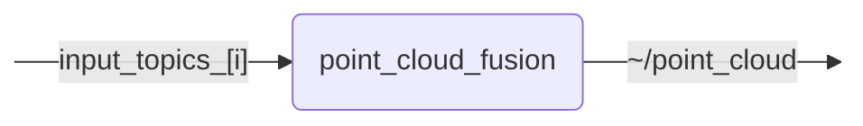

# `point_cloud_fusion`

Fuses multiple point clouds into a single point cloud with common target frame.

## Nodes

### `point_cloud_fusion`

Subscribes to the point-cloud topics configured in `input_topics`, transforms
them into `target_frame`, and publishes one fused point cloud. The input and
output use `point_cloud_transport`, allowing transport plugins to be selected
through the node parameters.

#### Subscribed Topics

| Topic | Type | Description |
| --- | --- | --- |
| `input_topics_[i]` | `sensor_msgs/msg/PointCloud2` | Point-cloud topics to fuse |

#### Published Topics

| Topic | Type | Description |
| --- | --- | --- |
| `~/point_cloud` | `sensor_msgs/msg/PointCloud2` | Output topic for the fused point cloud |

#### Parameters

| Parameter | Type | Default | Description |
| --- | --- | --- | --- |
| `target_frame` | `string` | `"base_link"` | Frame into which all input point clouds are transformed before fusion |
| `input_topics` | `string[]` | `[]` | Point-cloud topics to fuse |
| `input_transport_hints` | `string[]` | `[]` | Transport hint for each input topic; unspecified entries use raw |
| `sync_queue_size` | `int` | `3` | Queue depth for approximate-time synchronization |
| `output_queue_size` | `int` | `10` | Queue depth for the fused output publisher |
| `output_fields` | `string[]` | `[]` | Fields retained in the fused output; an empty list retains all input fields |
| `output_stamp_mode` | `string` | `"earliest"` | Fused timestamp selection: earliest, latest, mean, or input0 |
| `fixed_points_per_input_cloud` | `int` | `0` | Runtime-reconfigurable maximum valid point count per input cloud; 0 disables the limit |
| `use_cuda` | `bool` | `true` | Runtime-reconfigurable backend selection; true uses CUDA and false uses CPU |
| `range_limits.enable` | `bool` | `false` | Enable XYZ range filtering after transformation into target_frame |
| `range_limits.x_min` | `float` | `-1000.0` | Minimum x coordinate in target_frame to keep [m] |
| `range_limits.x_max` | `float` | `1000.0` | Maximum x coordinate in target_frame to keep [m] |
| `range_limits.y_min` | `float` | `-1000.0` | Minimum y coordinate in target_frame to keep [m] |
| `range_limits.y_max` | `float` | `1000.0` | Maximum y coordinate in target_frame to keep [m] |
| `range_limits.z_min` | `float` | `-20.0` | Minimum z coordinate in target_frame to keep [m] |
| `range_limits.z_max` | `float` | `20.0` | Maximum z coordinate in target_frame to keep [m] |
| `max_time_diff_sec` | `float` | `0.05` | Maximum timestamp spread across a synchronized input batch in seconds |
| `age_penalty` | `float` | `0.1` | Age penalty used by the approximate-time synchronizer |

## Launch Files

### [`point_cloud_fusion.launch.py`](launch/point_cloud_fusion.launch.py)

| Argument | Default | Description |
| --- | --- | --- |
| `point_cloud_topic` | `"~/point_cloud"` | Output topic for the fused point cloud |
| `name` | `"point_cloud_fusion"` | Node name. |
| `namespace` | `""` | Node namespace. |
| `params` | `os.path.join(get_package_share_directory("point_cloud_fusion"), "config", "params.yml")` | Path to the parameter file. |
| `log_level` | `"info"` | ROS logging level (debug, info, warn, error, fatal) |
| `use_sim_time` | `"false"` | Use the simulation clock. |
| `trace` | `"false"` | Enable ROS tracing. |
